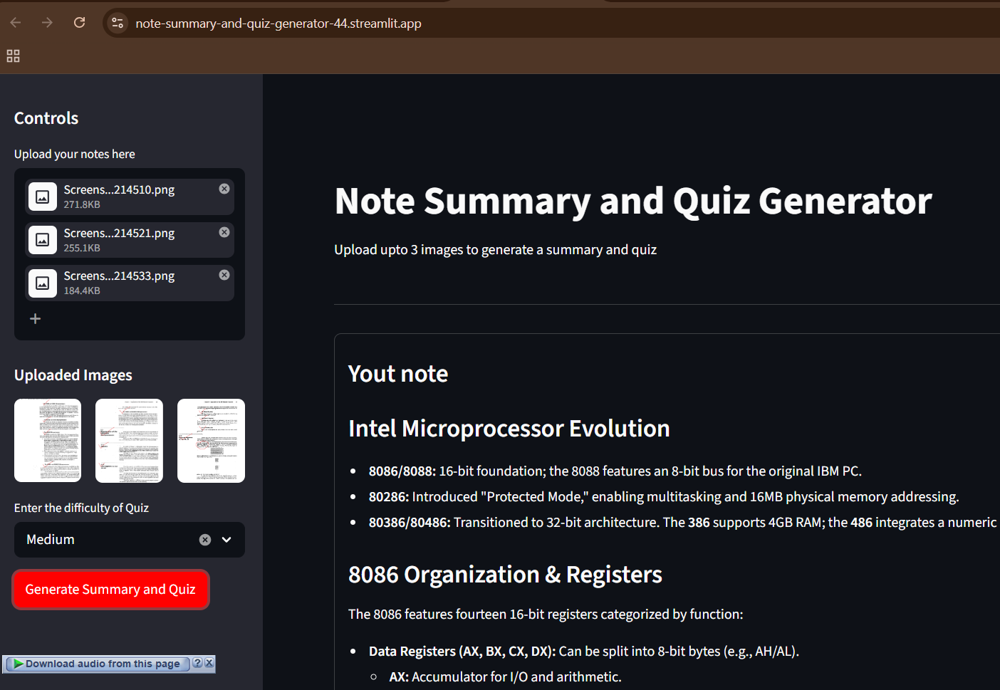

# Note-Summary-and-Quiz-Generator

## 🚀 Deployed Application

**Live Demo:** https://note-summary-and-quiz-generator-44.streamlit.app/

## 📋 Overview

A Streamlit API Based  web application that:
- 📸 Uploads and processes note images
- 📝 Generates AI-powered note summaries using Google Gemini
- 🎵 Creates audio versions of summaries using Google Text-to-Speech
- 🧠 Generates quizzes with configurable difficulty levels


## 📦 Requirements

```
streamlit
google-genai
python-dotenv
gTTS
Pillow
```

## 📸 Screenshot



## 🔧 Installation

1. Clone the repository
2. Create a virtual environment:
   ```bash
   python -m venv .venv
   .venv\Scripts\Activate.ps1
   ```
3. Install dependencies:
   ```bash
   pip install -r requirements.txt
   ```
4. Create a `.env` file with your Gemini API key:
   ```
   GEMINI_API_KEY=your_api_key_here
   ```
5. Run the app:
   ```bash
   streamlit run app.py
   ```
